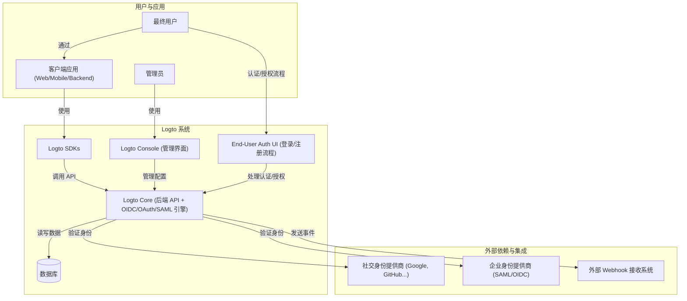

# Logto 项目架构与功能分析

本文档旨在帮助新成员快速理解 Logto 项目的整体架构和核心功能。

## 1. Logto 简介

Logto 是一个开源的身份解决方案，可作为 Auth0、Okta、Firebase Auth 或 AWS Cognito 等商业身份服务的替代品。它专注于提供全面的 **客户身份和访问管理 (CIAM)** 功能，帮助开发者轻松地为其应用程序和服务集成安全、现代化的登录、注册和用户管理流程。

Logto 旨在简化身份验证和授权的复杂性，提供开箱即用的体验，同时也具备高度的可扩展性和可定制性。

## 2. 高层架构

Logto 采用 **Monorepo** 架构，使用 `pnpm workspaces` 进行管理。这意味着所有相关的包（如核心逻辑、控制台 UI、各种 SDK 等）都在同一个代码仓库中进行开发和维护 (`packages/` 目录下)。

其主要组件包括：

*   **Logto Core**: 后端服务，实现了 OIDC/OAuth 2.0/SAML 等标准协议，提供核心的认证、授权和用户管理 API。这是整个系统的基础。
*   **Logto Console**: 一个基于 Web 的管理界面，允许管理员配置应用程序、连接器（社交登录、企业 SSO）、用户角色、组织、自定义 UI 等。
*   **End-User Experience**: 提供一套预构建的、用户友好的认证流程 UI（登录、注册、密码重置、MFA 设置等），支持主题定制和国际化。
*   **SDKs (Software Development Kits)**: 提供多种语言和框架的 SDK（如 React, Vue, Next.js, Node.js, Python, Go, Flutter, Android, iOS 等），简化在不同应用中集成 Logto 的过程。
*   **APIs**: 提供丰富的 API，允许开发者进行更深层次的集成和自动化管理。

## 3. 主要功能 (Logto 能做什么)

Logto 提供了广泛的身份认证和授权相关功能：

### 3.1 认证 (Authentication)

*   **多种登录方式**:
    *   传统的用户名/密码登录。
    *   无密码登录 (邮件验证码、短信验证码)。
    *   社交登录 (通过 OIDC/OAuth 2.0 连接 Google, GitHub, Apple, Facebook 等)。
    *   企业级单点登录 (SSO) (通过 SAML/OIDC 连接 Azure AD, Okta, Google Workspace 等)。
*   **多因素认证 (MFA)**: 支持 TOTP (如 Google Authenticator)、Passkey (WebAuthn)、备用验证码等方式增强账户安全。
*   **安全特性**:
    *   个人访问令牌 (PAT)。
    *   OAuth 2.0 授权码流程、客户端凭证流程、隐式流程 (不推荐) 等。
    *   同意屏幕 (Consent Screen) 管理。
    *   密码策略和泄露密码检测。

### 3.2 授权 (Authorization)

*   **API 保护**: 使用 JWT 或 Opaque Token (通过内省) 保护你的 API 资源。
*   **基于角色的访问控制 (RBAC)**:
    *   定义用户角色和权限。
    *   支持应用级和组织级的 RBAC。
    *   支持机器到机器 (M2M) 应用的 RBAC。
*   **自定义声明**: 在 Access Token 或 ID Token 中添加自定义数据 (Claims)。
*   **组织/多租户**: 为 SaaS 应用提供多租户支持，包括组织隔离、组织级角色、成员邀请、Just-In-Time (JIT) 用户配置等。

### 3.3 身份管理 (Identity Management)

*   **用户管理**:
    *   完整的用户生命周期管理 (创建、读取、更新、删除)。
    *   用户个人资料管理 (Profile)。
    *   用户邀请流程。
    *   用户数据导入/导出和迁移支持。
*   **身份联合**: 允许用户使用来自不同身份提供商的凭证登录多个关联应用 (Omni sign-in)。
*   **用户模拟**: 管理员可以临时模拟成某个用户进行调试或支持。
*   **审计日志**: 记录关键操作和安全事件。
*   **Webhooks**: 当特定事件发生时（如用户注册、登录失败等），向外部系统发送通知。

### 3.4 用户体验与定制

*   **预构建认证流程**: 提供美观、开箱即用的登录、注册、MFA 设置等页面。
*   **UI 定制**: 支持自定义品牌 Logo、颜色主题、页面模板、CSS。
*   **国际化 (i18n)**: 支持多种语言。
*   **自定义域名**: 将 Logto 服务托管在自己的域名下。

## 4. 集成能力

Logto 强调其易于集成的特性：

*   **广泛的 SDK 支持**: 覆盖主流的前端、后端、移动端框架。
*   **标准协议**: 基于 OIDC, OAuth 2.0, SAML 等开放标准，易于与遵循这些标准的任何系统集成。
*   **通用连接器**: 可以连接各种社交登录平台和企业身份提供商。

## 5. 范围与局限性 (Logto 不能做什么 / 非核心目标)

虽然 Logto 功能强大，但了解其边界也很重要：

*   **专注于身份认证和授权**: Logto 的核心是 CIAM。它不提供非身份相关的功能，例如：
    *   支付处理
    *   内容管理系统 (CMS)
    *   通用的数据库服务
    *   项目管理工具
*   **复杂的授权模型**: 虽然提供 RBAC，但对于需要极细粒度访问控制（如基于属性的访问控制 ABAC）或复杂策略逻辑的场景，可能需要额外的定制或与其他授权系统（如 Open Policy Agent）集成。
*   **基础设施/网络层安全**: Logto 主要解决应用层和用户身份的安全问题，不直接处理网络防火墙、DDoS 防护等基础设施层面的安全。
*   **不是通用的 API 网关**: 虽然能保护 API，但它不是一个功能全面的 API 网关（缺少请求路由、速率限制、请求转换等高级网关功能）。

## 6. 如何开始

*   查阅官方文档: [https://docs.logto.io](https://docs.logto.io)
*   查看代码仓库中的贡献指南 (`.github/CONTRIBUTING.md`)。
*   尝试本地运行或使用 GitPod/Docker 快速启动。

希望这份文档能帮助你快速上手 Logto 项目！ 

